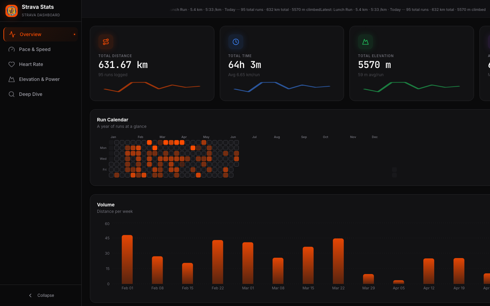
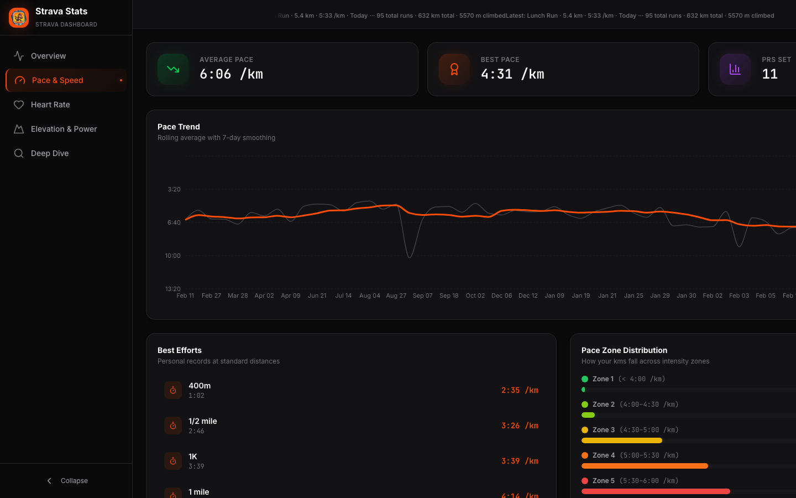
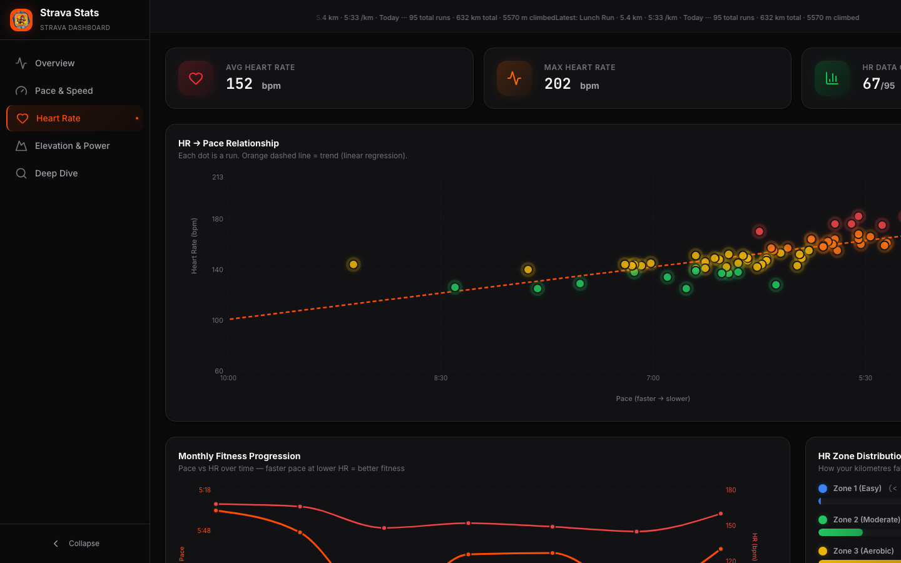
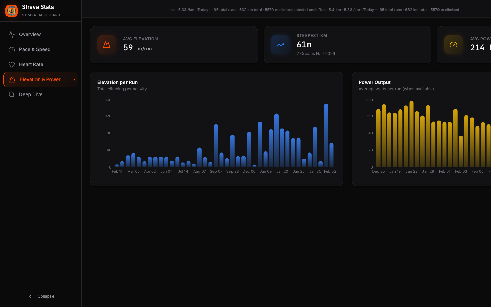
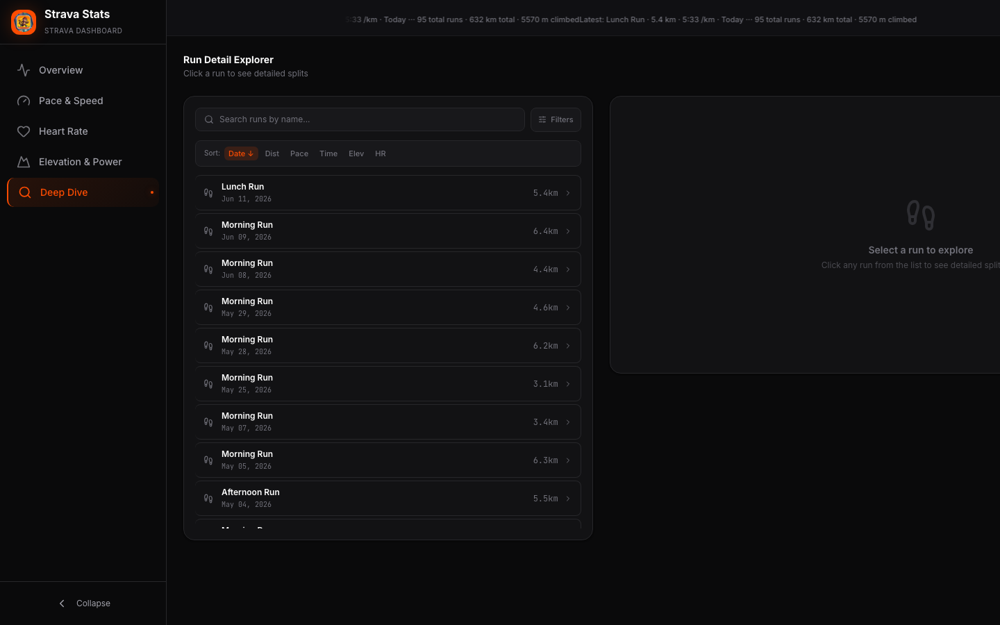

# Strava Dashboard

<p align="center">
  
</p>

<p align="center">
  <b>Personal running analytics powered by AI</b> —
  a full-stack dashboard that pulls your Strava data, visualises every metric,
  and delivers AI-powered coaching analysis.
</p>

<p align="center">
  
  
  
  
  
  
  
  
</p>

---

## Features

| Tab | What it shows |
|-----|---------------|
| **Overview** | Heatmap calendar, stat cards (total km, runs, time, elevation), weekly/monthly/yearly volume chart, recent runs table |
| **Pace** | Pace zone distribution, per-run pace trend with gradient area, sparkline stat cards |
| **Heart Rate** | HR zone distribution, pace-vs-HR scatter plot with glow dots, max HR sparkline |
| **Elevation** | Elevation gain per run bar chart, cumulative elevation trend |
| **Deep Dive** | Sortable/filterable run explorer with per-km splits (pace, GAP, HR, elevation) and AI coaching analysis |

### Sorting & Filtering
- **Sort** runs by date, distance, pace, time, elevation, or heart rate — ascending or descending
- **Search** by run name with real-time filtering
- **Advanced filters** for date range, distance, pace, time, elevation, and HR — all combinable

### AI Coaching
- On-demand AI analysis via Google Gemini
- Auto-generated for the latest run on page load
- Three-model fallback chain: `gemini-2.0-flash` → `2.0-flash-lite` → `2.5-flash`

### Data Sources
- **Strava API** — live sync of recent runs
- **CSV fallback** — offline mode with historical data built into the frontend
- **Apple Health** — incoming integration via Shortcuts automation

---

## Screenshots

| Overview | Pace |
|:--------:|:----:|
|  |  |

| Heart Rate | Elevation |
|:----------:|:---------:|
|  |  |

| Deep Dive |
|:---------:|
|  |

---

## Architecture

```
┌─────────────┐     ┌──────────────────┐     ┌──────────────┐
│   React     │────▶│   FastAPI        │────▶│   SQLite     │
│   Vite      │     │   (uvicorn)      │     │   (SQLModel) │
│   Recharts  │◀────│                  │     │              │
│   Tailwind  │     │  /api/runs       │     │  runs.db     │
│   date-fns  │     │  /api/analyses   │     │  94 runs     │
└─────────────┘     │  /api/health     │     └──────────────┘
                    │  /api/sync       │
                    └────────┬─────────┘
                             │
                    ┌────────▼─────────┐     ┌──────────────────┐
                    │   Strava API     │     │   Google Gemini  │
                    │   (OAuth v3)     │     │   (genai SDK)    │
                    └──────────────────┘     └──────────────────┘
```

- **Frontend**: React 19 + Vite 8, Recharts 3, Tailwind CSS 4, lucide-react, date-fns
- **Backend**: Python + FastAPI, SQLite via SQLModel, Strava API v3, Google Gemini API
- **Pattern**: Frontend fetches from `localhost:8000`; falls back to embedded CSV when the API is offline
- **Retry**: Tenacity exponential backoff for Gemini rate limits (429)

---

## Quick Start

### Prerequisites
- Python 3.12+
- Node.js 22+
- npm

### 1. Clone & install

```bash
git clone <your-repo-url> strava_dashboard
cd strava_dashboard/strava_data_pipeline

# Backend
cd backend
python3 -m venv .venv
source .venv/bin/activate
pip install fastapi uvicorn sqlmodel python-dotenv requests tenacity google-genai aiosqlite

# Frontend
cd ../frontend
npm install
```

### 2. Configure environment

```bash
cd ../backend
cp .env.example .env   # or create from scratch
```

| Variable | Required | Description |
|----------|----------|-------------|
| `CLIENT_ID` | Yes | Strava API application ID |
| `CLIENT_SECRET` | Yes | Strava API application secret |
| `REFRESH_TOKEN` | Yes | Strava OAuth refresh token |
| `AUTH_CODE` | For initial token | Strava OAuth authorisation code |
| `GEMINI_API_KEY` | No (AI optional) | Google Gemini API key |
| `MAKE_WEBHOOK_URL` | No | Make.com webhook for automation |
| `DATABASE_URL` | No | Defaults to `sqlite:///./runs.db` |

### 3. Start

```bash
# Terminal 1 — backend
cd backend
source .venv/bin/activate
python start_api.py

# Terminal 2 — frontend
cd frontend
npm run dev
```

Open **http://localhost:5173** in your browser.

### Offline mode
The frontend includes a built-in CSV of historical runs. It renders fully without the backend — just run `npm run dev` and the dashboard displays 67 runs with all tabs working.

---

## API Endpoints

| Method | Path | Description |
|--------|------|-------------|
| `GET` | `/api/runs` | All runs with splits and best efforts |
| `GET` | `/api/runs/latest` | Most recent run + AI analysis |
| `GET` | `/api/runs/{id}` | Single run detail |
| `GET` | `/api/analyses` | List all cached analyses |
| `GET` | `/api/analyses/{id}` | Analysis for a run (generates if missing) |
| `GET` | `/api/health` | Server health + Strava sync status |
| `POST` | `/api/sync` | Trigger Strava sync |

---

## Project Structure

```
strava_data_pipeline/
├── backend/
│   ├── api.py                  # FastAPI routes + lifespan
│   ├── start_api.py            # Entry point (uvicorn)
│   ├── database.py             # SQLite engine, session, init
│   ├── models.py               # SQLModel: Run, Split, BestEffort
│   ├── run_store.py            # Data access layer (CRUD + CSV seed)
│   ├── strava_api.py           # Strava API client
│   ├── authoriser.py           # OAuth token refresh
│   ├── gemini_analysis.py      # Gemini AI with retry + fallback
│   ├── analysis_service.py     # On-demand analysis generation
│   ├── analysis_store.py       # Analysis cache (JSON files)
│   ├── make_integration.py     # Make.com webhook handler
│   ├── health_receiver.py      # Apple Health shortcuts receiver
│   ├── migrate_to_db.py        # One-time JSON→SQLite migration
│   └── data_processor.py       # Data formatting helpers
│
├── frontend/
│   ├── src/
│   │   ├── components/
│   │   │   ├── overview/       # OverviewTab, Heatmap, StatCard
│   │   │   ├── pace/           # PaceTab
│   │   │   ├── heartrate/      # HeartRateTab
│   │   │   ├── elevation/      # ElevationTab
│   │   │   ├── deepdive/       # DeepDiveTab (explorer + splits)
│   │   │   └── layout/         # DashboardLayout, Header, Sidebar, SettingsPanel
│   │   └── data/
│   │       ├── api.js          # API client (fetch → mapRun)
│   │       ├── computeStats.js # All aggregations + zone logic
│   │       ├── runs.js         # CSV fallback (67 runs)
│   │       ├── parseCSV.js     # CSV parser
│   │       └── theme.jsx       # Accent colour theme system
│   └── public/
│       ├── screenshots/        # README screenshots
│       └── app_logo.png        # Dashboard logo
│
├── .gitignore
└── README.md
```

---

## Customisation

### Accent Colour
Toggle between 7 accent colours via the gear icon in the header:
- Strava Orange, Purple, Red, Green, Blue, Pink, Teal

Persisted in `localStorage` and applied via CSS custom properties in Tailwind's `@theme` blocks.

### Theme
The dark theme is always-on with a glass-morphism aesthetic (`glass-card`), subtle borders, and a colour-coded zone system for pace and heart rate.

---

## Future

- **Docker Compose** — containerised deployment with a single `docker compose up`
- **Apple Health** — deeper integration of health metrics alongside running data
- **Pacing strategy heatmap** — per-km pace breakdowns across all runs
- **Training load** — CTL/ATL/TSB style fatigue modelling

---

## License

MIT
